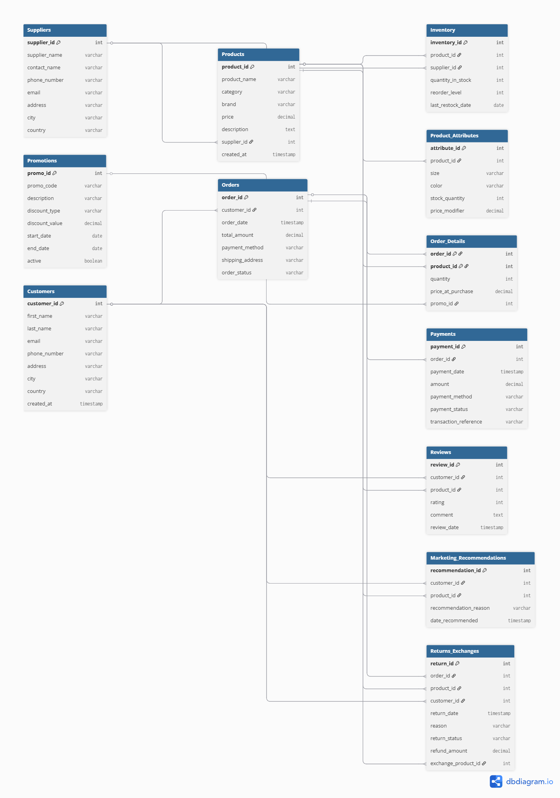

# Ecommerce SQL Analytics Project

This project is a structured SQL portfolio based on an e-commerce database.  
It demonstrates real analytical SQL skills across multiple categories including joins, subqueries, unions, CASE expressions, problem-solving queries, and schema design.

All queries work on a custom-built ecommerce schema and follow a clean, organized layout.

---

## Project Structure
assets/
ecommerce_sql/
schema.sql
dates.sql
cases.sql
joins.sql
subqueries.sql
unions.sql
problems.sql
README.md

Each `.sql` file focuses on a specific SQL concept used in real-world retail analytics.

---

## Entity Relationship Diagram (ERD)

This ERD represents the full e-commerce database used throughout the project.

---

## File Overview

### **schema.sql**
Contains all `CREATE TABLE` statements for:
- Customers  
- Suppliers  
- Products  
- Product Attributes  
- Inventory  
- Orders & Order Details  
- Payments  
- Promotions  
- Reviews  
- Recommendations  
- Returns & Exchanges  

This file defines the full database structure.

---

### **dates.sql**
Queries involving:
- Orders by month  
- New customers by year  
- Daily sales  
- Average order value  
- Stock and price history  
- Customer lifecycle dates  
- Active promotions  

---

### **cases.sql**
CASE expression examples for:
- Customer regions  
- Order value tiers  
- Product pricing levels  
- Inventory risk  
- Payment categories  
- Review sentiment  
- Promotion descriptions  

---

### **joins.sql**
Join operations across:
- Customers & Orders  
- Order Details & Products  
- Products & Suppliers  
- Inventory with product info  
- Payments with orders  
- Reviews with customer and product details  
- Returns with order and product history  

---

### **subqueries.sql**
Analytical subqueries including:
- Above-average spenders  
- Products above category average  
- Supplier product coverage  
- Orders above customer AOV  
- Low-stock products  
- Promo usage  
- Customers with no orders  

---

### **unions.sql**
UNION examples combining:
- Customer and supplier contacts  
- Promo vs regular orders  
- Out-of-stock vs low-stock  
- Positive vs negative reviews  
- Payment success vs failure  
- Returned vs exchanged products  

---

### **problems.sql**
Challenge-style SQL problems that simulate real analysis tasks:
1. Top customers by spending  
2. Products with highest return rate  
3. Suppliers with above-average pricing  
4. Most profitable product  
5. Frequent return customers  
6. Low-inventory risk products  
7. Highest-rated products  
8. Customers with highest lifetime value  

These queries demonstrate applied analytics in an e-commerce environment.

---

## Purpose of This Project

This repository serves as:
- A personal SQL portfolio  
- A demonstration of real analytics use cases  
- A teaching resource for SQL study  
- A template for structured SQL projects  
- A practical e-commerce data model for analysis  

---

If you'd like to extend this project with more files, dashboards, or analyses, feel free to explore and build on the existing structure.
